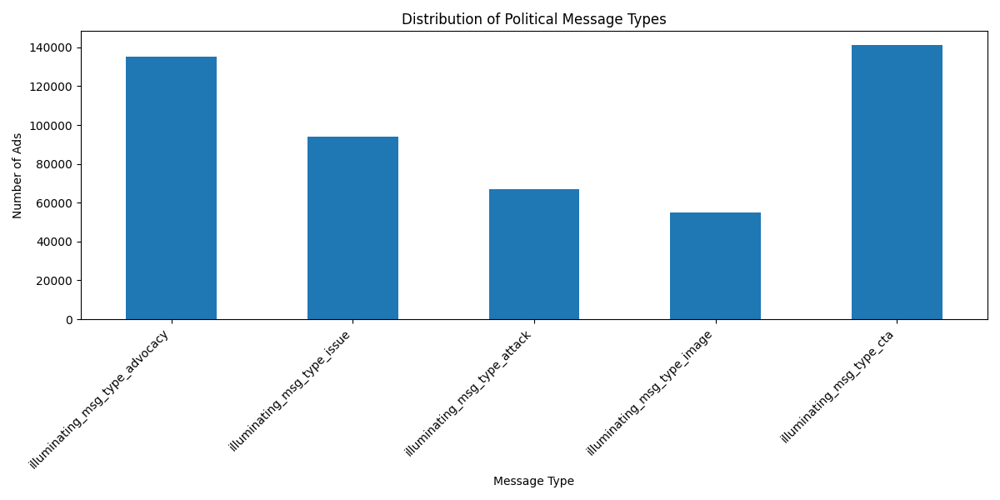
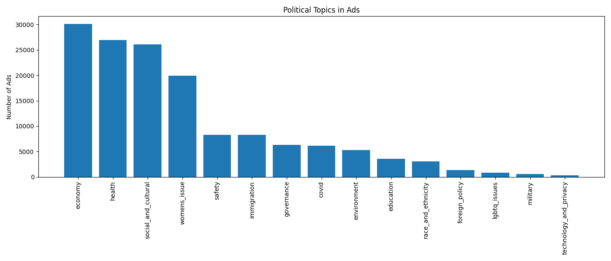
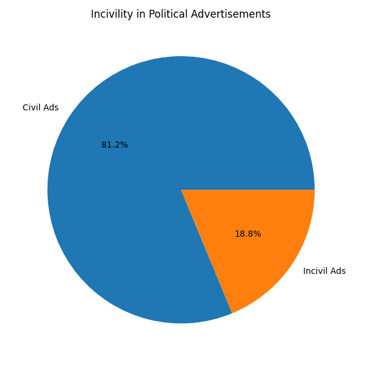

# Descriptive Analysis of Facebook Political Ads (2024)

## Project Overview
This project performs a comprehensive descriptive analysis of a dataset containing Facebook political advertisements related to the 2024 U.S. presidential election. The goal is to explore patterns in campaign messaging, topic focus, audience engagement strategies, and the tone of political discourse.

The analysis is conducted using both:
- Pure Python (manual statistical computation)
- Pandas (efficient data analysis)

Additionally, visualizations are created to highlight key insights.

---

## Dataset Description
The dataset consists of **246,745 political advertisements** with **40 features**, including:

- Ad metadata (ID, page, timestamps)
- Estimated impressions and spending
- Message types (advocacy, issue, attack, image)
- Policy topics (economy, health, immigration, etc.)
- Call-to-action indicators (fundraising, voting, engagement)
- Incivility indicators

---

## Project Structure
```bash
descriptive-stats-project/ 
│ 
├── pure_python_stats.py # Descriptive statistics using core Python 
├── pandas_stats.py # Analysis using Pandas 
├── visualizations.py # Data visualizations (matplotlib) 
│ 
├── output/ # Generated charts 
│ ├── message_type_distribution.png 
│ ├── top_topics.png 
│ └── incivility_distribution.png 
│ 
├── README.md # Project documentation 
├── FINDINGS.md # Detailed analysis and insights 
├── requirements.txt # Dependencies (for pandas + visualization) 
│ 
└── fb_ads_president_scored_anon.csv # (Not included - see Dataset Access section)
```
---

## Dataset Access

The dataset used in this project is not included in this repository due to size and usage restrictions.

You can download the dataset from the following source:
[https://drive.google.com/file/d/1gvtvX8fATFrrzraPmTSf205U8u3JExUR/view?usp=sharing]

### Instructions:
1. Download the dataset file
2. Rename it to:
   fb_ads_president_scored_anon.csv
3. Place it in the root project directory:

## How to Run the Project

### Step 1: Install dependencies

pip install pandas matplotlib

### Step 2: Run scripts in order

python pure_python_stats.py
python pandas_stats.py
python visualizations.py

---

## Visualizations

### Message Type Distribution


### Top Political Topics


### Incivility in Ads


---

## Key Insights

- Political campaigns heavily rely on **advocacy and call-to-action messaging**
- **Economic and healthcare issues** dominate campaign narratives
- Social media ads are widely used for **fundraising and voter mobilization**
- A significant portion of ads contain **incivil or polarizing language**

---

## Pure Python vs Pandas

| Aspect | Pure Python | Pandas |
|------|------|------|
| Implementation | Manual | Automated |
| Complexity | High | Low |
| Speed | Slower | Faster |
| Transparency | High | Abstracted |

Using pure Python provided a deeper understanding of statistical computations, while Pandas significantly improved efficiency and scalability.

---

## Conclusion

This project demonstrates how descriptive statistics and exploratory data analysis can be used to understand political communication strategies. The findings highlight the role of social media in modern campaigns, particularly in persuasion, mobilization, and fundraising.

---

## Author
Arsh Chandrakar  
M.S. Information Systems (Data Science), Syracuse University
